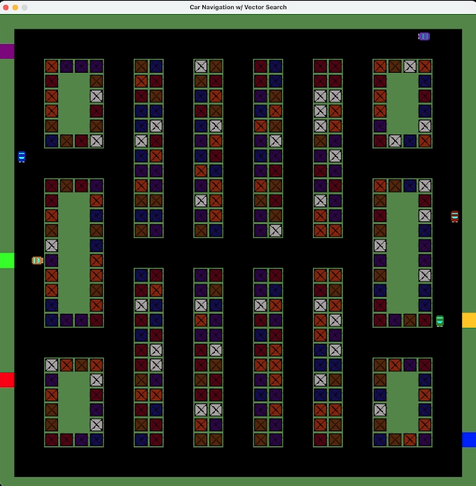

# carNavigation
An implementation of the Java client for the Data API, using a pure vector approach for autonomous vehicle navigation. Up to 8 cars can be seeded on the map. Each will run a vector search using its starting and ending points. The resulting road segments are returned via a Euclidean-based similarity. Each car then takes the best path that it can to drive on the roads to their destination.

## Known issues
 - Cars drive through each other.
 - If they are not currently on a vector, cars may:
     - drive over lawns.
     - drive through buildings.
     - drive on the wrong side of the road.

## Requirements

 - Java 21 (JRE)
 - Environment variables
     - `ASTRA_DB_ENDPOINT`
     - `ASTRA_DB_TOKEN`

## To build:

### Build Requirements

 - Maven

The [pom.xml](pom.xml) file can be adjusted to build with earlier versions of Java, but it is not recommended to go below 17.

### Build command

    mvn clean install

### Running the build

    java -jar target/carnavigation-0.0.1-SNAPSHOT-jar-with-dependencies.jar
